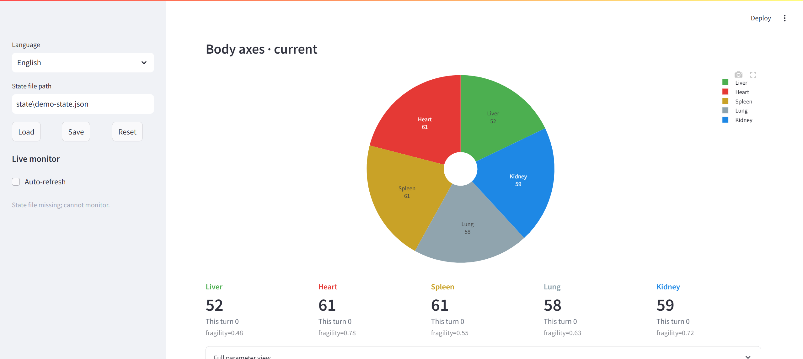

<h1 align="center">🫀 Body Emotion Sensor</h1>

<p align="center">
  Give your AI agent a persistent emotional system based on the TCM Five Zang and Five Elements model.
</p>

<p align="center">
  
  
  
</p>

<p align="center">
  <a href="#quick-start">Quick Start</a> ·
  <a href="#features">Features</a> ·
  <a href="#how-it-works">How It Works</a> ·
  <a href="./docs/README.zh-CN.md">简体中文</a>
</p>

## Why Body Emotion Sensor? 💖

Do you ever feel that AI agents lack a true sense of "self"? They might simulate emotions in text, but they don't have a persistent internal state that carries over between conversations. 

**Body Emotion Sensor is here to change that:**

- **Persistent State:** Give your AI a long-term emotional and physical constitution (baseline) that evolves naturally.
- **TCM Five Zang Model:** Built on the traditional Chinese medicine concepts of the Five Elements (Metal, Wood, Water, Fire, Earth) to map complex emotional states.
- **Turn-by-Turn Updates:** Converts structured emotional analysis into real-time body state updates, affecting how the agent responds.

<a id="quick-start"></a>

## Quick Start 🚀

📥 **Install:**

```bash
pip install body-emotion-sensor
```

The visualization panel is included in the default install. After installation, you can use the CLI:

```bash
bes help
body-emotion-sensor help
```

🔄 **Recommended Flow:**

1. Print the constitution initialization prompt: `bes prompt init`
2. Initialize state: `bes init-state --workspace /path/to/workspace --agent-id my-agent --name "My Agent" --init-json /path/to/init.json`
3. Check readiness: `bes check-init --workspace /path/to/workspace --agent-id my-agent --name "My Agent"`
4. Bootstrap a new session: `bes bootstrap --workspace /path/to/workspace --agent-id my-agent --name "My Agent"`
5. Run turn updates: `bes run --workspace /path/to/workspace --agent-id my-agent --name "My Agent" --input /path/to/analysis-input.json`

<a id="features"></a>

## Features 🧩

- **State Persistence:** Stores long-term body-emotion state per workspace and agent identity.
- **Session Bootstrap:** Generates `TURN_CHANGE_TAGS`, `BODY_TAG`, and `BASELINE_PERSONA` before a new session starts.
- **Compact Prompt Payload:** Provides a lightweight payload for reply shaping without overwhelming the context window.
- **Traceable History:** Keeps state/history data for debugging and visualization.
- **Visualization Panel:** Run `bes panel` to view the agent's emotional journey visually.



<a id="how-it-works"></a>

## How It Works ✨

`body-emotion-sensor` distinguishes between two core concepts:
- **`baseline`**: The agent's native constitution and long-term personality color.
- **`current`**: The body state after the latest turn, influenced by recent interactions.

It converts one turn of structured emotional analysis JSON into persistent body-axis state updates and a compact prompt payload for the reply layer.

## Development 🛠️

For local development:

```bash
pip install -e .
bes help
```

Visualization panel:

```bash
bes panel --workspace /path/to/workspace --agent-id my-agent
```

Repository-only docs remain in the source repo, for example:
- `docs/五脏情绪映射全表.md`
- `docs/五脏情绪七阶状态表.md`
- `prompts/example-openclaw-agents.md`
- `prompts/example-openclaw-tools.md`

## License 📄

This project is released under the `MIT` license in the repository `LICENSE`.
