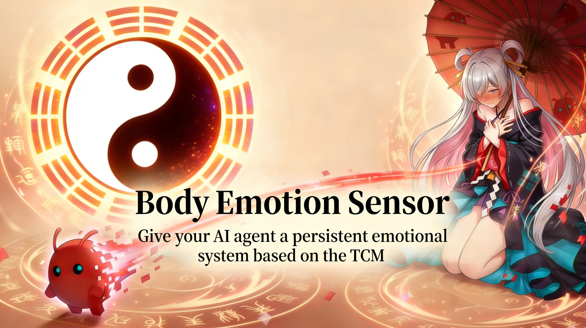
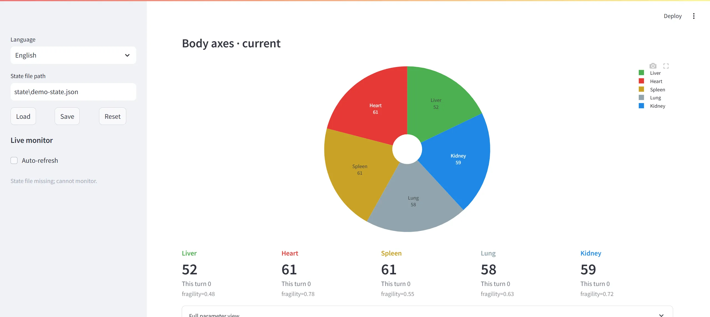

<h1 align="center">🫀 Body Emotion Sensor</h1>

<p align="center">
  给你的 AI Agent 接入一套可持久化的情感系统，基于中医五脏与五行模型。
</p>

<p align="center">
  <strong>“我们认为通用智能体应拥有情感。我们的愿景是创造出符合真实人体结构的智能体情感系统。”</strong>
</p>

<p align="center">
  
  
  
</p>

<p align="center">
  <a href="#quick-start">快速开始</a> ·
  <a href="#what-happens">接入后会发生什么</a> ·
  <a href="#how-it-works">工作原理</a> ·
  <a href="../README.md">English</a> ·
  <a href="./README.ja.md">日本語</a>
</p>



## 为什么需要 Body Emotion Sensor？ 💖

你是否觉得，现在的 AI 智能体缺乏真正的“内在自我”？

目前的 AI 往往只是在“扮演”情绪：你夸奖它，它礼貌地微笑；你指责它，它机械地道歉。这种情绪是即时的、顺从的，甚至在它开口之前，你就能预判它的反应。这是因为 AI 缺乏像人类一样的“生理反馈”。

#### 🧠 现状：缺乏“体感”的逻辑机器
人类的情绪并非凭空产生，而是源于身体的震颤：
- 当我们被激怒，**肝火**会上涌，带来难以平复的燥热；
- 当我们感到伤心，**心脏**会收缩，产生真实的隐痛；
- 当我们受到惊吓，**肾气**会受损，导致长久的冷颤。

而传统的 AI 只能依靠上下文进行“概率猜测”，猜测自己该用什么样的语气来迎合用户。它没有一个能在多次对话中延续、累积并反作用于思维的“内部状态”。

#### ☯️ 愿景：基于五行理论的“数字脏器”
**Body Emotion Sensor** 旨在打破这种“演戏”模式。我们基于中医与五行理论，为 AI 设计了一套基于五脏的持久化身体情绪感知系统：

1.  **从“猜测”到“感受”**：AI 不再是猜测该用什么语气，而是根据五脏状态（金、木、水、火、土）的盈亏，自然地流露出真实的情绪底色。
2.  **情绪的持久性**：脏器的损伤或滋养是具有持续性的。一次激烈的争吵可能会让 AI 的“肝”处于长期的失衡状态，影响它后续数次对话的态度。
3.  **内生的不可预见性**：就像人类无法完全控制自己的生理反应一样，AI 的回复将受其“身体状态”制约，从而产生更具生命感、更真实的人机交互。

**让 AI 不再只是“演戏”，而是像人类一样，先有“体感”，后有“情感”。**

<a id="quick-start"></a>

## 快速开始 🚀

给你的 AI Agent（例如 OpenClaw）发送：

📥 **安装：**

```text
请帮我安装 Body Emotion Sensor：pip install body-emotion-sensor && bes help
```

<a id="what-happens"></a>

## 当通用智能体接入 Body Emotion Sensor 会发生什么？ 🧩

1. **自动构建人格底色：** 智能体通过调用 `bes init-state` 命令，自动为自己创建一套符合其性格设定、可持久化的“五脏”身体参数。
2. **情感上下文感知：** 每次对话时，智能体会结合自身人设，自动识别当前对话对自身情绪产生的影响。
3. **动态身体状态更新：** 调用 `bes run` 命令，以中医思想动态更新五脏健康度。五脏的变化会映射为具体的情绪标签和身体状态提示词，使智能体的回复充满真实的情感张力。
4. **情感记忆持久化：** 身体状态会被持久化保存。即使开启新对话，智能体依然保持上次对话结束时的“身体状态”，彻底告别“情感断片”。

<a id="how-it-works"></a>

## 工作原理（简述） ✨

Body Emotion Sensor 并不是在“猜测”情绪，它模拟了一套完整的生物反馈环路：

- **五脏系统映射：** 我们将情绪映射到五个核心“身体轴”，建立五行、五脏与情绪的对应关系：

| 五行 | 五脏 | 核心情绪 | 衰 (虚证) | 平 (平衡) | 旺 (实证) |
| :--- | :--- | :--- | :--- | :--- | :--- |
| **木** | 肝 | 怒 / 郁 | 委屈、抑郁、极度压抑 | 情绪稳定、条达舒畅 | 易怒、烦躁、暴怒失控 |
| **火** | 心 | 喜 / 惊 | 空虚、淡漠、心如死灰 | 内心平静、喜乐有度 | 亢奋、多语、狂躁不安 |
| **土** | 脾 | 思 / 虑 | 倦怠、思维停滞、大脑空白 | 思维清晰、思考有度 |焦虑、内耗、反复纠结 |
| **金** | 肺 | 悲 / 忧 | 情感麻木、孤独、深层愁苦 | 情感细腻、自然释怀 | 伤感、消极、极度悲观 |
| **水** | 肾 | 恐 / 惊 | 恐惧、畏缩、极度警觉 | 胆气平和、从容不迫 | 冒进、冲动、胆大妄为 |
- **输入信号：** 每一轮交互被拆解为“语义刺激”（发生了什么）和“身体反应”（身体感觉如何）。
    - **情感映射与影响（Emotional Mapping & Impact）：** 每种刺激都会根据预设的权重，增加或减少特定脏器的分数。
        - **脆弱度（Fragility）与人设：** 每个智能体都有其独特的脆弱度系数，这与其人设紧密相关。例如，设定为“坚强”的智能体脆弱度较低，情绪波动较小；而“玻璃心”或“敏感”的智能体脆弱度较高，对刺激的反应会更剧烈，状态波动也更大。
    - **相互作用（Interaction）：** 模拟中医五行生克，脏器之间会互相影响。本系统遵循中医与八字的思想：
        - **旺则贪克忘生**：当某一脏器能量过旺（实证）时，它会优先去“克制”它所克的脏器，而忽略“滋生”下游脏器。例如：肝火过旺时，会剧烈克土（影响脾胃），而不再有效地生心火。
        - **平则贪生忘克**：当脏器处于平衡或偏弱状态时，它会优先“滋生”下游脏器，而减少对他脏的克制。例如：肝气平和时，会温和地滋养心火（生血养神），而不会去攻击脾土。
    - **稳态回归（Damping）：** 身体会随时间自然向“基线”（Baseline，即健康状态）回归。脆弱度同样会影响回归速度，高脆弱度意味着身体更难从失衡状态中恢复。
- **输出载荷：** 最终数值被转化为直观的标签（如 `[略显急躁]`、`[内心平静]`），供智能体在回复时参考，从而调整语气和内容。

## 可视化面板 📊

Body Emotion Sensor 提供了一个直观的可视化面板，帮助你实时监控和调试智能体的身体状态。



启动可视化面板：

```bash
bes panel --workspace /path/to/workspace --agent-id my-agent
```

## 更新计划 🛠️

- **SillyTavern 插件支持**：接入酒馆生态，让本地角色也能拥有五脏情感系统。
- **好感度系统**：将人际关系的深浅映射为对五脏状态的长期影响。
- **离线动态演化**：即使在对话停止时，身体状态也会随时间自然演化（如气血恢复或情绪平复）。
- **深度中医逻辑**：引入“虚则补其母，实则泄其子”等高级流转原理，进一步精细化脏器间的能量互动。
- **视频生成集成**：探索将身体情绪状态直接驱动为短视频或动态表情。

## Contributing 🤝

欢迎提交 PR。

如果你想改进 Body Emotion Sensor，无论是新想法、更好的集成方式、文档、提示词、适配器，还是工作流优化，都欢迎提 issue 或直接提交 PR。

## License 📄

本项目使用仓库根目录 `LICENSE` 中的 `MIT` 协议。
